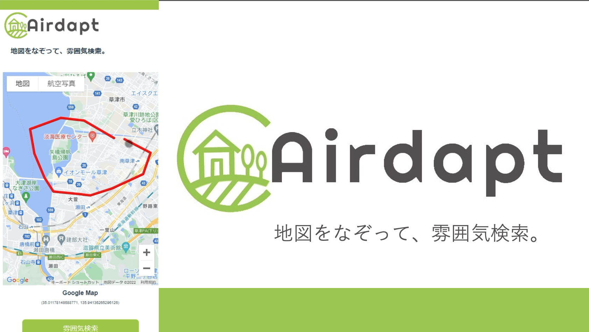

# Airdapt - 地図をなぞって、雰囲気検索。

## 製品概要

**「Airdapt」** - 地図をなぞって雰囲気検索ができるwebアプリ

### 背景(製品開発のきっかけ、課題等）

- [home's の地図から検索](https://www.homes.co.jp/chintai/map/) に代表されるような，地図から賃貸物件を検索するサービスはいくつかすでに存在する
- 物件検索の際は，通勤通学などの都合から鉄道沿線検索をすることも多い
- `駅から徒歩n分`といった情報はどの物件にも書かれている

地図を見ても物件周辺の生活環境が分かりづらく，実際に足を運ぶと印象が全く違うことがある．
**自分たちが家探す時に，実際に足運んだら印象が全然変わってしまう現象をなんとかしたい** という背景のもと，開発をおこなった．

### 製品説明（具体的な製品の説明）

Airdaptは，足を運ばないと感じられない街の "空気感" を検索します．つまり，ユーザが既に雰囲気や感覚を知っているエリアをそのまま"なぞり入力"してもらい，それを検索パターンとして日本国内から"空気感"が似ている地域を見つけ出すのです．

### 特長
#### 1. なぞるだけで簡単に検索

細かい条件検索の入力は必要ありません．土地勘のある場所で，こんな場所がいいな，というところをなぞるだけで検索！

#### 2. AIによる雰囲気検索

特定の条件が一致するか，といった検索方法ではなく，あらかじめ学習してある土地の特徴情報を照らし合わせながら，指定されたエリアに近い雰囲気を持つ場所を提示します．

#### 3. 建物だけに集中しない検索提案

賃貸物件検索において，建物の情報は多く提示されますが，その地域の雰囲気やエリアについて考える機会はあまり多くありません．このプロダクトでは，建物ではなくエリアに注目しています！

### 解決出来ること

新たな引越し先を決めるとき，色々なエリアに対して細やかな検索条件をかけて調べるのは大変です．また，せっかく細かく調べて物件を決めても，実際見に行くと家はいいけど周辺環境の雰囲気が肌に合わない...ということもあります．
このプロダクトを使用すると，一度にさまざまなエリアに対して検索を行うことができ，いきなり物件を検索するのではなく，土地勘や空気感が近いエリアからまず調べ始めることができます．

### 今後の展望

マッチングアルゴリズムの改善や緯度経度情報の扱い方をアップデートしつつ，インターフェースの操作性をより向上させていきたい．
一方で，ユーザに細かな入力させるのではなく，あくまで大雑把な入力から提案を行うかたちは維持したい．

### 注力したこと（こだわり等）
* ユーザに'雰囲気'をあえて言語化させない設計
* 提案アルゴリズムもモデルの中間特徴ベクトルを活用し，特定の要素や物体を検出するのではなく'雰囲気'のマッチングを行わせる

## 開発技術 
### 活用した技術

AIモデルを使用したバックエンドの実装については[こちら](server/satellite_resnet18)をご覧ください．

#### API・データ
* Google Map API

#### フレームワーク・ライブラリ・モジュール
* Vue.js
* PyTorch
* Flask

### 独自技術
#### ハッカソンで開発した独自機能・技術
* 指定地点に類似する候補地を衛星画像から推測するシステム