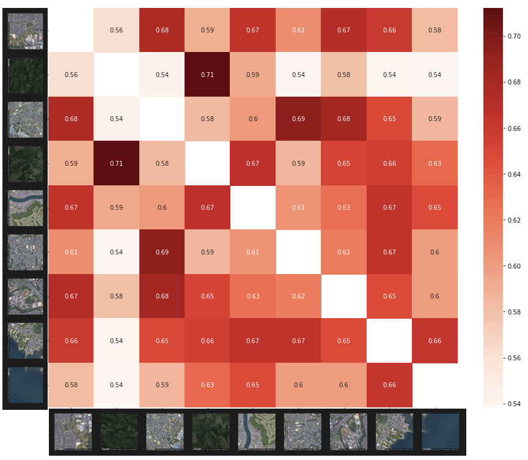

# 衛星写真データ解析プログラム

Google Mapにおける衛星写真を使用して，大雑把なエリア特徴を比較することで検索を行います．

## ファイルについて

### env.py

Google Maps APIを使用する際に必要なAPIアクセスキー．

### google_maps_api.py

Google Maps Static APIを使用して，指定ズーム(default 15)で230x230の画像を取得．

### MapsAPI_test.ipynb

Google Colab上での動作を想定．Google Maps APIからStatic Map画像を取得し，ResNet18の学習済モデルに入力した際の
中間特徴ベクトルを取得．各画像についての特徴ベクトルのコサイン類似度を取ることで，エリアの類似度を導き出す．

滋賀県 南草津周辺の市街地，山林区画，川沿い，琵琶湖岸などのデータで検証した結果が以下

